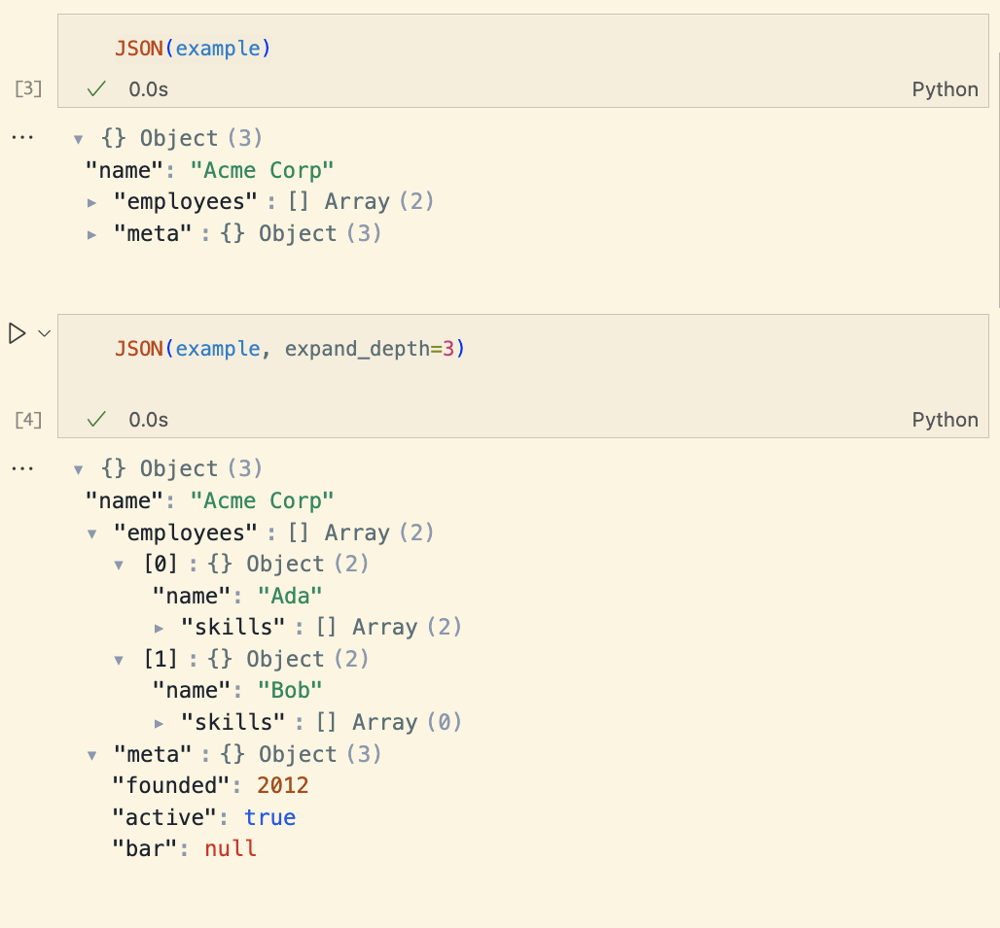

# json-tree
Expandable tree view for JSON-like data for Jupyter.  


## Example:
```python
from json_tree import JSON

example = {
    "name": "Acme Corp",
    "employees": [
        {"name": "Ada", "skills": ["CSS", "JS"]},
        {"name": "Bob", "skills": []},
    ],
    "meta": {"founded": 2012, "active": True, "bar": None},
}

JSON(example, expand_depth=2)
```
<div>

<div id="jt-4e44da67" class="jt"><details class="jt-details" open style="margin-left:0.0rem"><summary class="jt-summary">{} Object <span class="jt-punct">(3)</span></summary><div class="jt-leaf" style="margin-left:0.5rem"><span class="jt-key">"name"</span><span class="jt-punct">: </span><span class="jt-str">"Acme Corp"</span></div><details class="jt-details" open style="margin-left:0.5rem"><summary class="jt-summary"><span class="jt-key">"employees"</span><span class="jt-punct">: </span>[] Array <span class="jt-punct">(2)</span></summary><details class="jt-details" style="margin-left:1.0rem"><summary class="jt-summary"><span class="jt-key">[0]</span><span class="jt-punct">: </span>{} Object <span class="jt-punct">(2)</span></summary><div class="jt-leaf" style="margin-left:1.5rem"><span class="jt-key">"name"</span><span class="jt-punct">: </span><span class="jt-str">"Ada"</span></div><details class="jt-details" style="margin-left:1.5rem"><summary class="jt-summary"><span class="jt-key">"skills"</span><span class="jt-punct">: </span>[] Array <span class="jt-punct">(2)</span></summary><div class="jt-leaf" style="margin-left:2.0rem"><span class="jt-key">[0]</span><span class="jt-punct">: </span><span class="jt-str">"CSS"</span></div><div class="jt-leaf" style="margin-left:2.0rem"><span class="jt-key">[1]</span><span class="jt-punct">: </span><span class="jt-str">"JS"</span></div></details></details><details class="jt-details" style="margin-left:1.0rem"><summary class="jt-summary"><span class="jt-key">[1]</span><span class="jt-punct">: </span>{} Object <span class="jt-punct">(2)</span></summary><div class="jt-leaf" style="margin-left:1.5rem"><span class="jt-key">"name"</span><span class="jt-punct">: </span><span class="jt-str">"Bob"</span></div><details class="jt-details" style="margin-left:1.5rem"><summary class="jt-summary"><span class="jt-key">"skills"</span><span class="jt-punct">: </span>[] Array <span class="jt-punct">(0)</span></summary></details></details></details><details class="jt-details" open style="margin-left:0.5rem"><summary class="jt-summary"><span class="jt-key">"meta"</span><span class="jt-punct">: </span>{} Object <span class="jt-punct">(3)</span></summary><div class="jt-leaf" style="margin-left:1.0rem"><span class="jt-key">"founded"</span><span class="jt-punct">: </span><span class="jt-num">2012</span></div><div class="jt-leaf" style="margin-left:1.0rem"><span class="jt-key">"active"</span><span class="jt-punct">: </span><span class="jt-bool">true</span></div><div class="jt-leaf" style="margin-left:1.0rem"><span class="jt-key">"bar"</span><span class="jt-punct">: </span><span class="jt-null">null</span></div></details></details></div>
</div>

-----------

(Github preview with sanitize styles out of the example above.  See below for a screenshot)

## Screenshot


----------------

### Credits / Caveat
__Vibe coded with GPT-5-Pro in 30 minutes__
